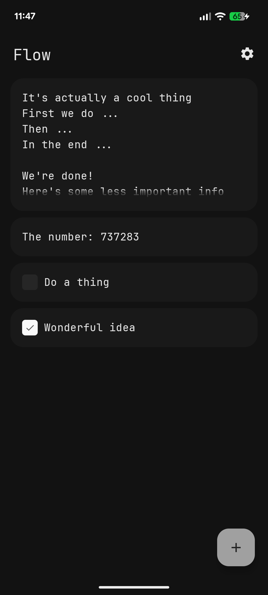
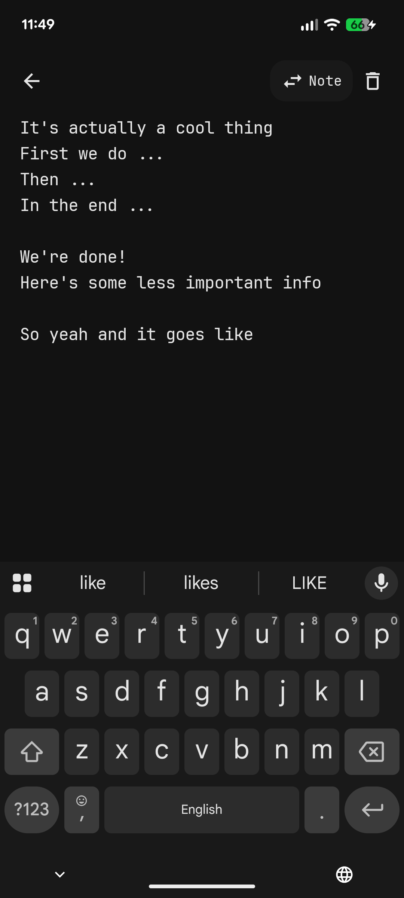
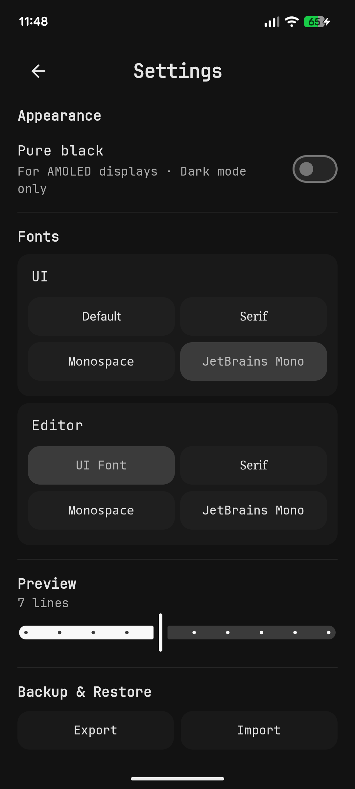
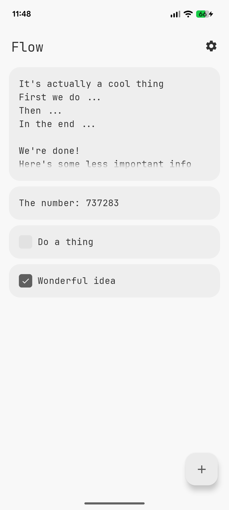
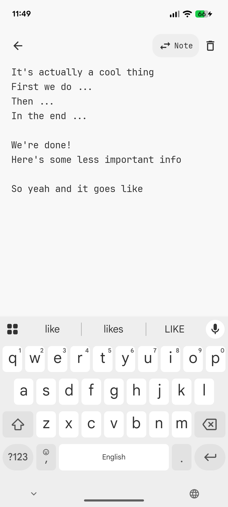
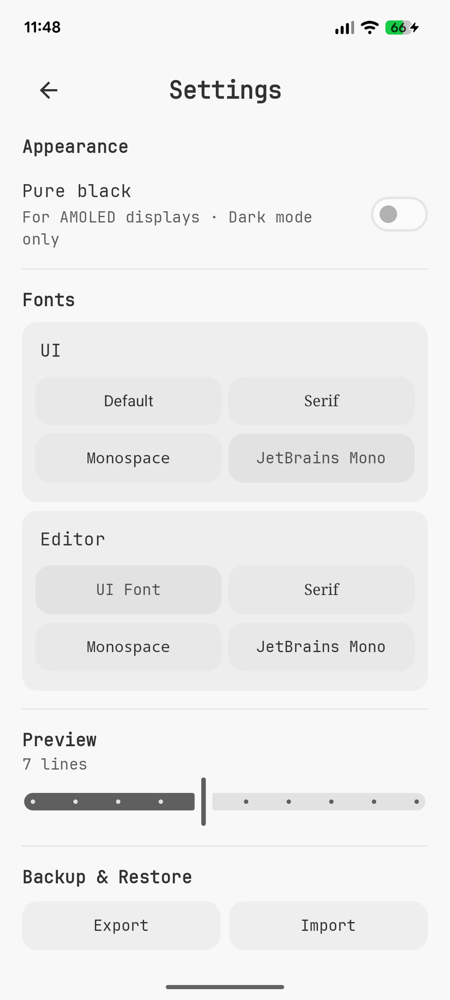

<h1>
  
  Flow
</h1>

Notes & Tasks app for Android. Fully native. Just your stuff, no bullshit

## Features

- Minimal editor
- Local-only storage
- Smooth, yet fast animations
- Swipe gestures
- Drag-and-drop reordering
- Material UI
- Dynamic colors on Android 12+
- AMOLED background option
- Predictive back gesture support (Android 16+)
- Customizable UI and editor fonts

## Installation

<a href="https://github.com/jvqtil/Flow/releases/latest">
  
</a>

# Building

- Clone the repository and open it in Android Studio.

- Build it with:
  ```bash
  ./gradlew assembleRelease
  ```

## Screenshots

### Dark

| Home                                    | Editing                                       | Settings                                        |
|-----------------------------------------|-----------------------------------------------|-------------------------------------------------|
|  |  |  |

### Light

| Home                                     | Editing                                        | Settings                                         |
|------------------------------------------|------------------------------------------------|--------------------------------------------------|
|  |  |  |


## Usage

Here's app functionality explained

### Creating and editing entries

Tap **+** in the bottom-right corner to create an entry.

Start typing. Changes are saved automatically when you leave the editor.

Tap any entry on the home screen to open and edit it.

### Notes and tasks

Entries can be either notes or tasks.

Swipe an entry to the **right** to switch between **Note** and **Task**.

Tasks have a checkbox. Tap it to mark a task as completed or incomplete.

You can also switch between note and task while editing.

### Reordering

Press and hold an entry, then drag it to where you want it.

### Deleting

Swipe an entry to the **left** and tap delete, or delete it from the editor.

After deleting, **Undo** appears at the bottom of the screen. Tap it to restore the entry.

### Attachments

Tap the attachment icon while editing to add files to an entry.

Tap an attachment to open it.

To remove an attachment, tap its delete button. **Undo** appears temporarily at the bottom of the screen.

### Navigation

Use the back button to leave the editor or return to the previous screen.
