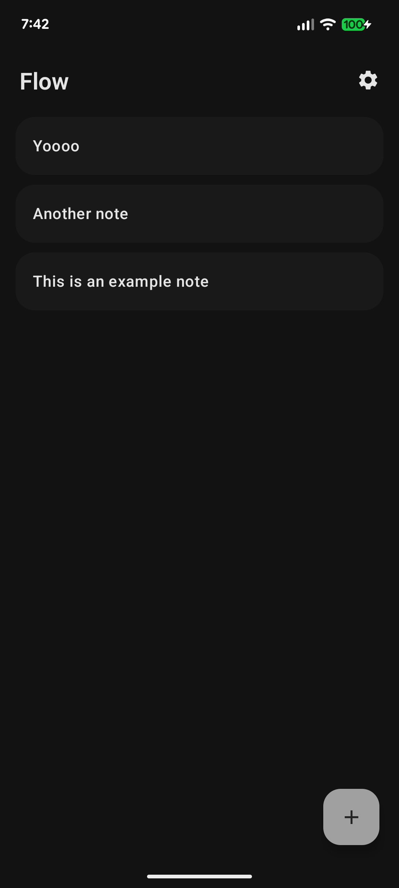
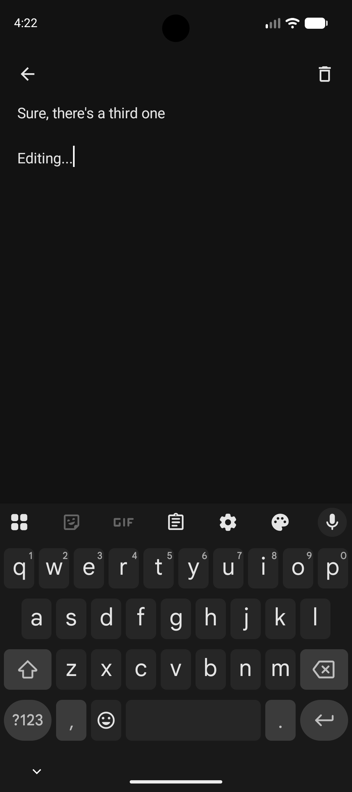
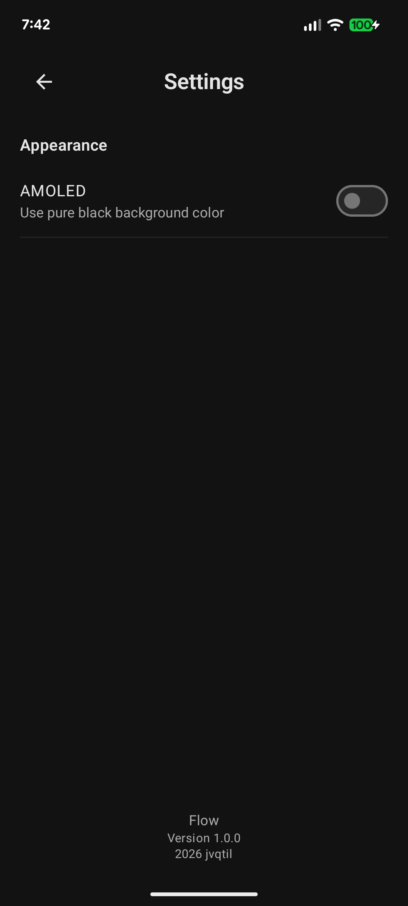
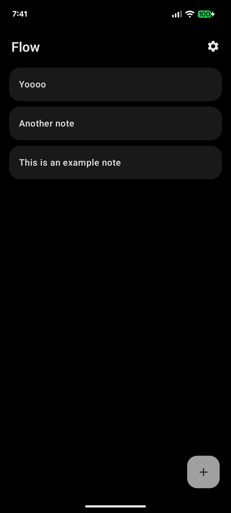
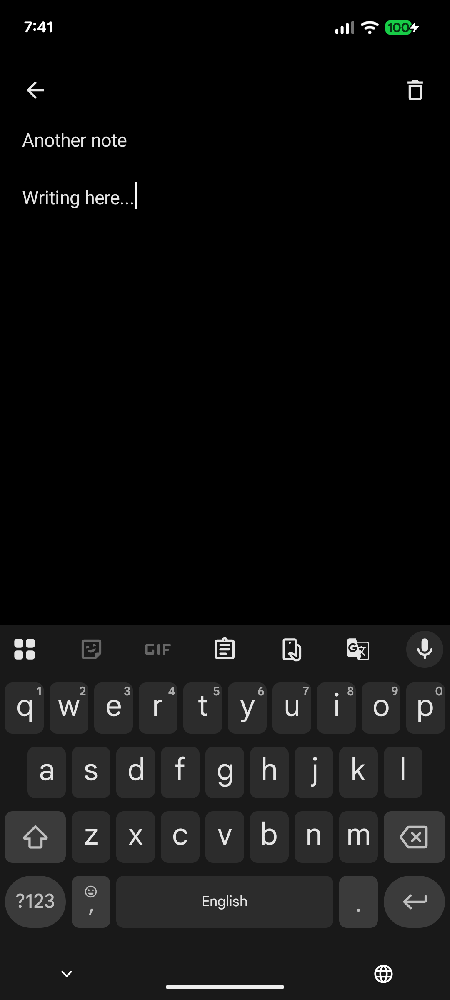
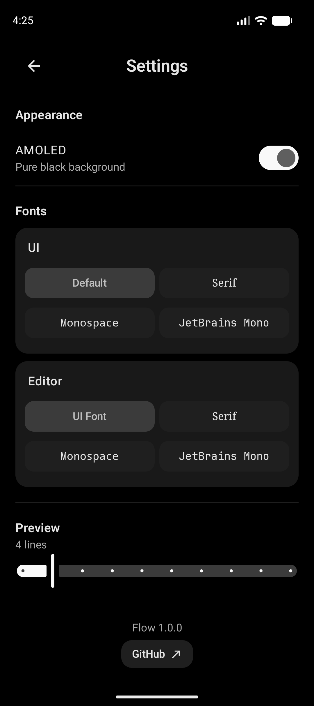
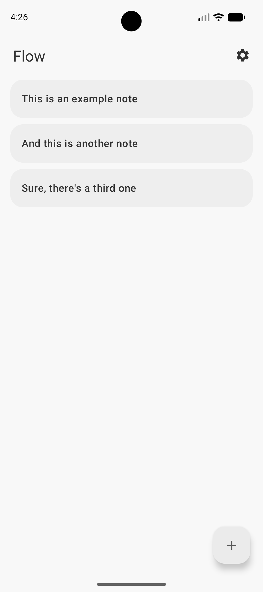
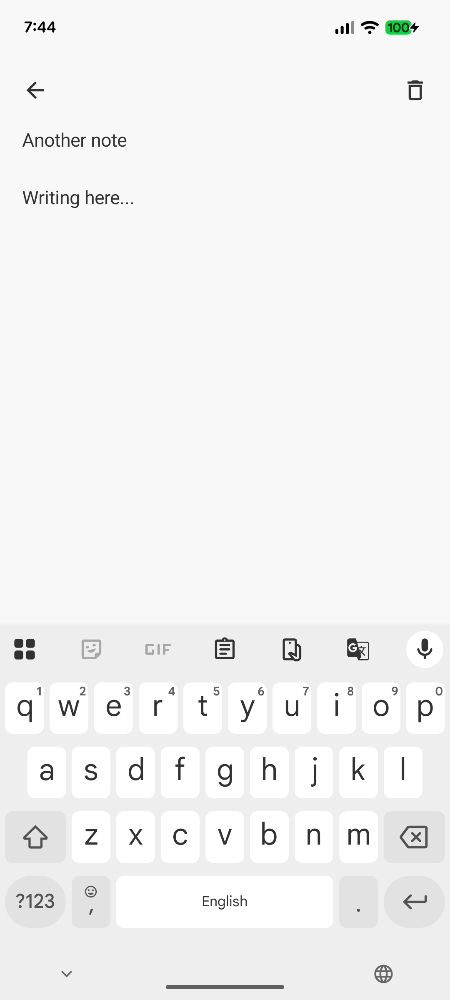
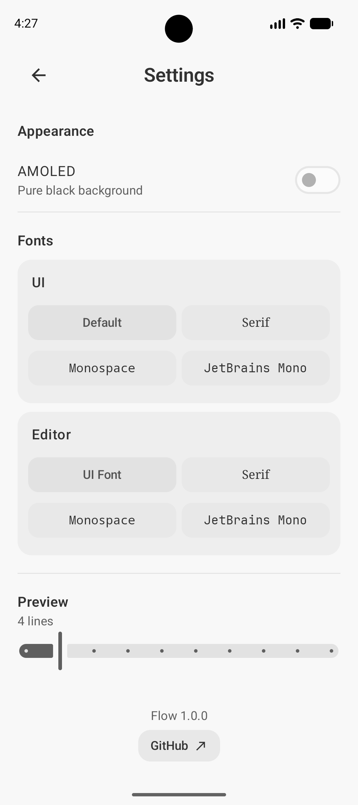

# Flow

Notes & Tasks app for Android. Fully native. Just your stuff, no bullshit

## Features

- Minimal editor
- Local-only storage
- Smooth, yet fast animations
- Swipe gestures
- Drag-and-drop reordering
- Material UI
- Dynamic colors on Android 12+
- AMOLED background option
- Predictive back gesture support (Android 16+)
- Customizable UI and editor fonts

## Installation

## Screenshots

### Dark

| Home                               | Editing                                  | Settings                                   |
|------------------------------------|------------------------------------------|--------------------------------------------|
|  |  |  |

### AMOLED

| Home                                 | Editing                                    | Settings                                     |
|--------------------------------------|--------------------------------------------|----------------------------------------------|
|  |  |  |

### Light

| Home                                | Editing                                   | Settings                                    |
|-------------------------------------|-------------------------------------------|---------------------------------------------|
|  |  |  |eenshots/Home_Light.png) |  |  |
